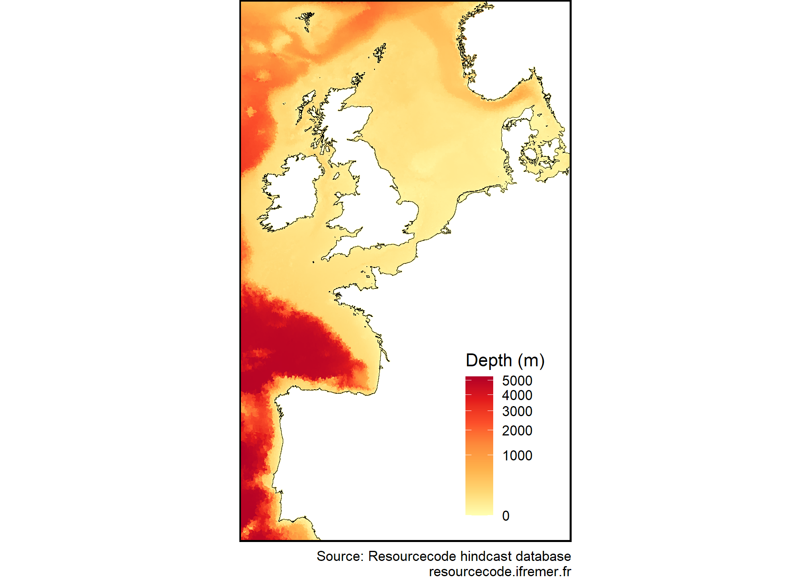

<!-- README.md is generated from README.Rmd. Please edit that file -->

# Resource**code** <a href="https://github.com/Resourcecode-project/r-resourcecode"></a>

<!-- badges: start -->

[](https://github.com/Resourcecode-project/r-resourcecode/actions/workflows/R-CMD-check.yaml)
[](https://app.codecov.io/gh/Resourcecode-project/r-resourcecode)
[](https://resourcecode-project.r-universe.dev/resourcecode)
[](https://CRAN.R-project.org/package=resourcecode)
[](https://CRAN.R-project.org/package=resourcecode)
<!-- badges: end -->

The goal of `{resourcecode}` is to provide an easy access to the
Resourcecode hindcast database of sea-states. More information on the
database can be found [here](https://resourcecode.ifremer.fr). This
website only contains information about the way to retrieve data from
this data base and the functionalities offred by this package.

## Installation

The `{resourcecode}` package is on CRAN so you can simply run :

``` r
install.packages("resourcecode")
```

You can install the development version of `{resourcecode}` thanks to
[r-universe](https://resourcecode-project.r-universe.dev/resourcecode):

``` r
install.packages("resourcecode",
  repos = c(
    "https://resourcecode-project.r-universe.dev",
    "https://cloud.r-project.org"
  )
)
```

or using the classical:

``` r
devtools::install_github("Resourcecode-project/r-resourcecode")
```

This package depends on data in a data package `{resourcecodedata}` that
is available on CRAN on will be installed when installing the package
for the first time.

## Examples

Plot the bathymetry used in the project

``` r
library(resourcecode)
library(resourcecodedata)
resourcecode::rscd_mapplot(rscd_field$depth, name = "Depth (m)", transform = "sqrt")
```



See the variables available in the database:

``` r
head(rscd_variables)
#>        name         longname         unit
#> 1 longitude        longitude  degree_east
#> 2  latitude         latitude degree_north
#> 3       tri              tri             
#> 4    MAPSTA       status map            1
#> 5       dpt            depth            m
#> 6      ucur eastward current        m s-1
```

Download a time series of significant wave height next to the coast of
Finistère:

``` r
data <- get_parameters(node = "134865", parameters = "hs")
str(data)
#> tibble [8,760 x 2] (S3: tbl_df/tbl/data.frame)
#>  $ time: POSIXct[1:8760], format: "1994-01-01 00:00:00" "1994-01-01 01:00:00" ...
#>  $ hs  : num [1:8760] 4.82 4.98 5.19 5.37 5.48 ...
#>  - attr(*, "node")= int 134865
#>  - attr(*, "longitude")= num -4.96
#>  - attr(*, "latitude")= num 48.3
if (!is.null(data)) plot(data, type = "l")
```


