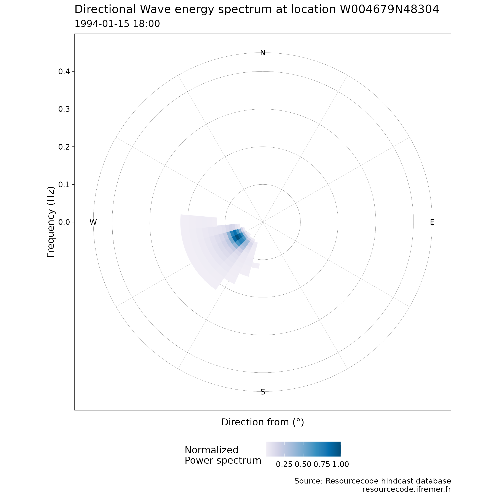

# Introduction to \`{resourcecode}\`

The goal of
[resourcecode](https://github.com/Resourcecode-project/r-resourcecode)
is to provide an easy access to the ResourceCODE hindcast database of
sea-states. More information on the database can be found
[here](https://resourcecode.ifremer.fr). We will explain in this
vignette the way to retrieve data from this database and some the
functionalities offered by this package.

This package depends on data in a data package
[resourcecodedata](https://github.com/Resourcecode-project/r-resourcecodedata/)
that is available through a `drat` repository on GitHub. To use the
[resourcecode](https://github.com/Resourcecode-project/r-resourcecode)
package, you will need to install
[resourcecodedata](https://github.com/Resourcecode-project/r-resourcecodedata/)
on your computer, using the following `install.packages` function (and
later update it using the `update.packages` function):

``` r
install.packages("resourcecodedata",
  repos = "https://resourcecode-project.github.io/drat/",
  type = "source"
)
```

Once the packages are installed, we can proceed as usual:

``` r
library(resourcecodedata)
library(resourcecode)
library(ggplot2)
```

## Database configuration: nodes, bathymetry…

There are two grids in the Resource**CODE** hindcast database: the full,
dense, **FIELD** grid, which is the grid where the numerical WWIII model
is run and where sea-state parameters and only 1D spectra are available.
The second grid, **SPEC**, is coarser, but contains the full 2D spectral
data at each node.

- **FIELD** grid

The variable `rscd_field` contains the coordinates of the FIELD grid,
along with the depth of these points and `d50`, the bottom sediment
type.

``` r
str(rscd_field)
#> 'data.frame':    328030 obs. of  5 variables:
#>  $ node     : int  1 2 3 4 5 6 7 8 9 10 ...
#>  $ longitude: num  6.92 6.91 6.92 6.93 6.95 ...
#>  $ latitude : num  62.9 62.9 62.9 62.9 62.9 ...
#>  $ depth    : num  3 3 3 3 3 3 3 3 3 3 ...
#>  $ d50      : num  0 1.32 1.32 1.32 1.32 ...
head(rscd_field)
#>   node longitude latitude depth   d50
#> 1    1  6.922498 62.91467     3 0.000
#> 2    2  6.910178 62.91301     3 1.322
#> 3    3  6.920552 62.90438     3 1.322
#> 4    4  6.933673 62.89938     3 1.322
#> 5    5  6.945979 62.90012     3 1.322
#> 6    6  6.958059 62.89899     3 1.322
```

At each location, a large number of sea-state parameters are available,
described in `rscd_variables`:

``` r
str(rscd_variables)
#> 'data.frame':    88 obs. of  3 variables:
#>  $ name    : chr  "longitude" "latitude" "tri" "MAPSTA" ...
#>  $ longname: chr  "longitude" "latitude" "tri" "status map" ...
#>  $ unit    : chr  "degree_east" "degree_north" "" "1" ...
head(rscd_variables)
#>        name         longname         unit
#> 1 longitude        longitude  degree_east
#> 2  latitude         latitude degree_north
#> 3       tri              tri             
#> 4    MAPSTA       status map            1
#> 5       dpt            depth            m
#> 6      ucur eastward current        m s-1
```

The available location can be plotted on a map using the following code.
It can be noticed here that the variables `rscd_coastline` and
`rscd_islands` contain the path of the coast line and the islands,
respectively.

``` r
lim_lon <- c(-5.25, -4.25)
lim_lat <- c(47.75, 48.75)
field_bzh <- ggplot(rscd_field, aes(x = longitude, y = latitude)) +
  geom_point(size = .1, col = "lightblue") +
  geom_path(data = rscd_coastline, linewidth = .2) +
  geom_path(data = rscd_islands, aes(group = .data$ID), linewidth = .2) +
  coord_sf(xlim = lim_lon, ylim = lim_lat, expand = FALSE, crs = sf::st_crs(4326)) +
  theme_void()
field_bzh
```


- **SPEC** grid

The spectral grid, or **SPEC** grid is coarser, with more than 24,000
nodes where the full 2D spectra are available. The grid can be added to
the previous plot to see the differences in the spatial coverage.

``` r
str(rscd_spectral)
#> 'data.frame':    24276 obs. of  5 variables:
#>  $ longitude: num  1.5 -5.5 -6 -6.5 -7 4.5 4 3.5 3 2.5 ...
#>  $ latitude : num  52 52 52 52 52 52.5 52.5 52.5 52.5 52.5 ...
#>  $ name     : chr  "E001500N52000" "W005500N52000" "W006000N52000" "W006500N52000" ...
#>  $ depth    : num  15.4 89.6 95.8 52.7 54.7 ...
#>  $ d50      : num  0.737 -0.8265 -1.585 0.737 0.0346 ...
head(rscd_spectral)
#>   longitude latitude          name    depth         d50
#> 1       1.5     52.0 E001500N52000 15.41327  0.73700004
#> 2      -5.5     52.0 W005500N52000 89.64895 -0.82650555
#> 3      -6.0     52.0 W006000N52000 95.83614 -1.58500008
#> 4      -6.5     52.0 W006500N52000 52.67409  0.73700004
#> 5      -7.0     52.0 W007000N52000 54.67464  0.03464983
#> 6       4.5     52.5 E004500N52500 14.18527  0.73700004
```

``` r
field_bzh + geom_point(data = rscd_spectral, col = "orange", size = .1)
```


- Helpers to find points

When one is interested in some location, we also provide helpers to find
the closest point in each of the grid, via the `closest_point_FIELD()`
and `closest_point_SPEC()` functions.

## Getting data

We have two different sources of data, the FIELD grid, and the SPEC
grid. We will cover each use case here.

- Sea-state parameters from the FIELD can be retrieved using the
  [`get_parameters()`](https://resourcecode-project.github.io/r-resourcecode/reference/get_parameters.md)
  function, which allows to download a time series easily at a given
  location. For the moment (Sept. 2023), the 1D spectra on this grid are
  not available to direct download.

For example, if one is interested in the time series of sea-state
parameters at some location, the following code can be adapted:

``` r
point_of_interest <- c(longitude = -4.6861533, latitude = 48.3026514)
node <- closest_point_field(point_of_interest)
node
#> $points
#>        [,1]
#> [1,] 134940
#> 
#> $distances
#>         [,1]
#> [1,] 288.974
ts <- get_parameters(node = node$point, parameters = c("hs", "tp", "dp", "cge"))
if (!is.null(ts)) {
  ggplot(tidyr::pivot_longer(ts, -1), aes(x = time, y = value, col = name)) +
    geom_line() +
    coord_cartesian(expand = FALSE) +
    facet_wrap(~name, ncol = 2, scales = "free_y") +
    scale_x_datetime(name = NULL, date_breaks = "month") +
    scale_y_continuous(name = NULL) +
    theme_minimal() +
    theme(
      legend.position = "none",
      axis.text.x = element_text(angle = 60, hjust = 1)
    )
}
```

- 1D and 2D spectra of the SPEC grid can be downloaded directly from
  IFREMER FTP using functions `get_1Dspectrum()` and `get_2Dspectrum()`.
  We also provide a plotting function for the 2D spectrum.

``` r
node_spectral_grid <- closest_point_spec(point_of_interest)
```

Then one can extract the 1D spectrum time-series and see the contents of
these downloaded data.

``` r
spec_1d <- get_1d_spectrum(node_spectral_grid$point, start = "1994-01-01", end = "1994-02-28")
str(spec_1d)
#> List of 12
#>  $ longitude : num -4.68
#>  $ latitude  : num 48.3
#>  $ frequency1: num [1:36(1d)] 0.0339 0.0356 0.0392 0.0431 0.0474 ...
#>  $ frequency2: num [1:36(1d)] 0.0356 0.0392 0.0431 0.0474 0.0521 ...
#>  $ ef        : num [1:36, 1:1416] 0.000526 0.0028 0.009767 0.145907 1.126401 ...
#>   ..- attr(*, "dimnames")=List of 2
#>   .. ..$ : NULL
#>   .. ..$ : NULL
#>  $ th1m      : num [1:36, 1:1416] 202 203 205 226 230 ...
#>   ..- attr(*, "dimnames")=List of 2
#>   .. ..$ : NULL
#>   .. ..$ : NULL
#>  $ th2m      : num [1:36, 1:1416] 202 203 205 180 180 ...
#>   ..- attr(*, "dimnames")=List of 2
#>   .. ..$ : NULL
#>   .. ..$ : NULL
#>  $ sth1m     : num [1:36, 1:1416] 13.5 13.9 14.5 16.6 14.7 ...
#>   ..- attr(*, "dimnames")=List of 2
#>   .. ..$ : NULL
#>   .. ..$ : NULL
#>  $ sth2m     : num [1:36, 1:1416] 26.1 26.8 28 32.2 28.7 ...
#>   ..- attr(*, "dimnames")=List of 2
#>   .. ..$ : NULL
#>   .. ..$ : NULL
#>  $ freq      : num [1:36(1d)] 0.0339 0.0373 0.041 0.0451 0.0496 ...
#>  $ forcings  : tibble [1,416 × 14] (S3: tbl_df/tbl/data.frame)
#>   ..$ time  : POSIXct[1:1416], format: "1994-01-01 00:00:00" "1994-01-01 01:00:00" ...
#>   ..$ dpt   : num [1:1416] 27 27.5 29 30.5 31.5 32.5 32.5 32 31 29.5 ...
#>   ..$ wnd   : num [1:1416] 12.2 11.6 10.8 10.9 10.8 ...
#>   ..$ wnddir: num [1:1416] 301 299 298 295 294 ...
#>   ..$ cur   : num [1:1416] 0.1 0.2 0.3 0.4 0.3 ...
#>   ..$ curdir: num [1:1416] 325 27.5 41.2 48.6 55.9 ...
#>   ..$ hs    : num [1:1416] 3.02 3.11 3.23 3.35 3.43 ...
#>   ..$ fp    : num [1:1416] 0.0672 0.067 0.0671 0.0672 0.0727 ...
#>   ..$ f02   : num [1:1416] 0.132 0.129 0.124 0.121 0.12 ...
#>   ..$ f0m1  : num [1:1416] 0.0905 0.0882 0.0864 0.0858 0.0862 ...
#>   ..$ th1p  : num [1:1416] 234 234 235 237 238 ...
#>   ..$ sth1p : num [1:1416] 13.4 13.3 13.1 12.9 12.7 ...
#>   ..$ dir   : num [1:1416] 239 239 239 240 241 ...
#>   ..$ spr   : num [1:1416] 19.6 19.5 18.8 18 17.4 ...
#>  $ station   : chr "W004679N48304"
```

The same applies to 2D spectra.

``` r
spec_2d <- get_2d_spectrum(node_spectral_grid$point, start = "1994-01-01", end = "1994-02-28")
str(spec_2d)
#> List of 9
#>  $ longitude : num -4.68
#>  $ latitude  : num 48.3
#>  $ frequency1: num [1:36(1d)] 0.0339 0.0356 0.0392 0.0431 0.0474 ...
#>  $ frequency2: num [1:36(1d)] 0.0356 0.0392 0.0431 0.0474 0.0521 ...
#>  $ efth      : num [1:36, 1:36, 1:1416] 0.00024 0.000629 0.000872 0.000705 0.000423 ...
#>   ..- attr(*, "dimnames")=List of 3
#>   .. ..$ : NULL
#>   .. ..$ : NULL
#>   .. ..$ : NULL
#>  $ freq      : num [1:36(1d)] 0.0339 0.0373 0.041 0.0451 0.0496 ...
#>  $ dir       : num [1:36(1d)] 0 10 20 30 40 50 60 70 80 90 ...
#>  $ forcings  : tibble [1,416 × 6] (S3: tbl_df/tbl/data.frame)
#>   ..$ time  : POSIXct[1:1416], format: "1994-01-01 00:00:00" "1994-01-01 01:00:00" ...
#>   ..$ dpt   : num [1:1416] 27 27.5 29 30.5 31.5 32.5 32.5 32 31 29.5 ...
#>   ..$ wnd   : num [1:1416] 12.2 11.6 10.8 10.9 10.8 ...
#>   ..$ wnddir: num [1:1416] 301 299 298 295 294 ...
#>   ..$ cur   : num [1:1416] 0.1 0.2 0.3 0.4 0.3 ...
#>   ..$ curdir: num [1:1416] 145 208 221 229 236 ...
#>  $ station   : chr "W004679N48304"
```

In addition, it is possible to plot the wave elevation directional
spectra for any given time, which can be specified by the time index or
directly the date:

``` r
if (!is.null(spec_2d)) plot_2d_specta(spec_2d, "1994-01-15 18:00")
```


